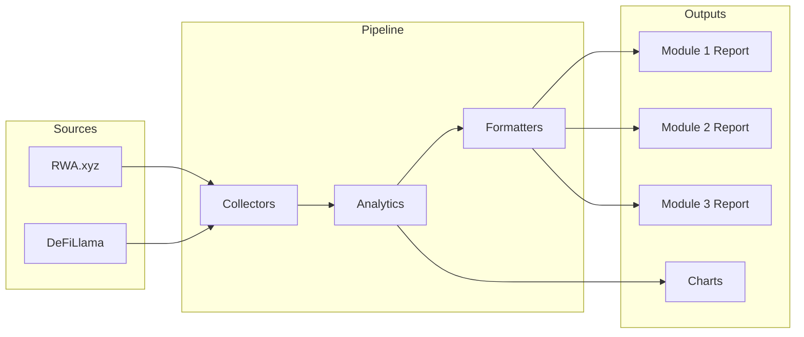
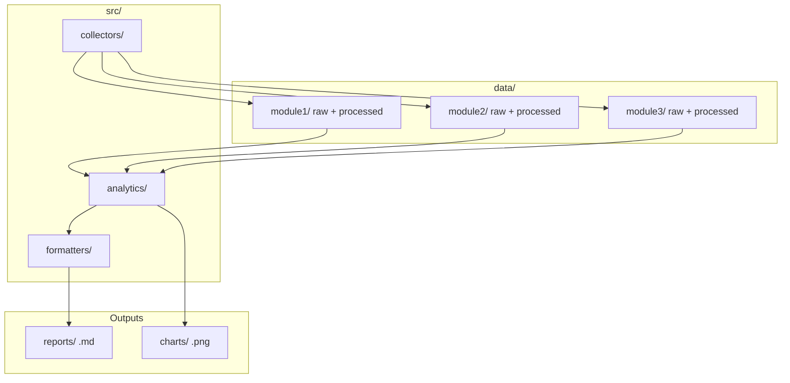
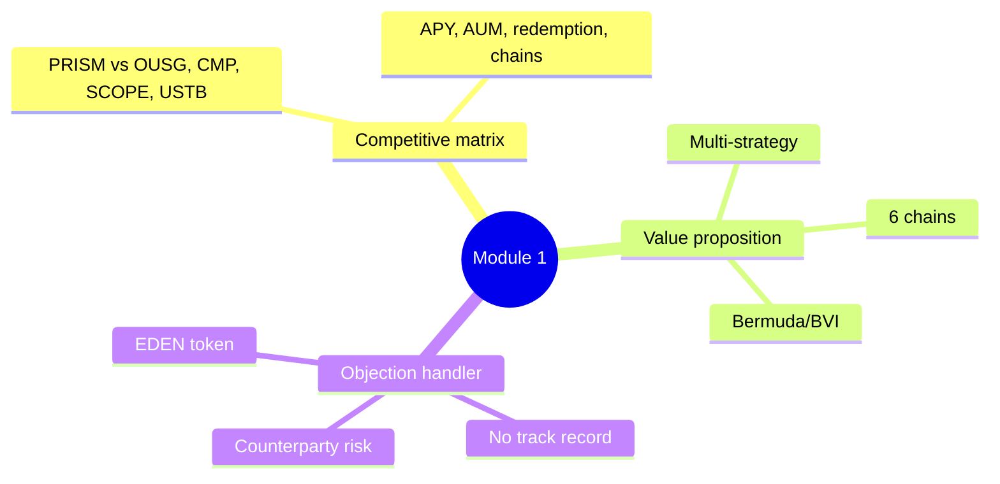
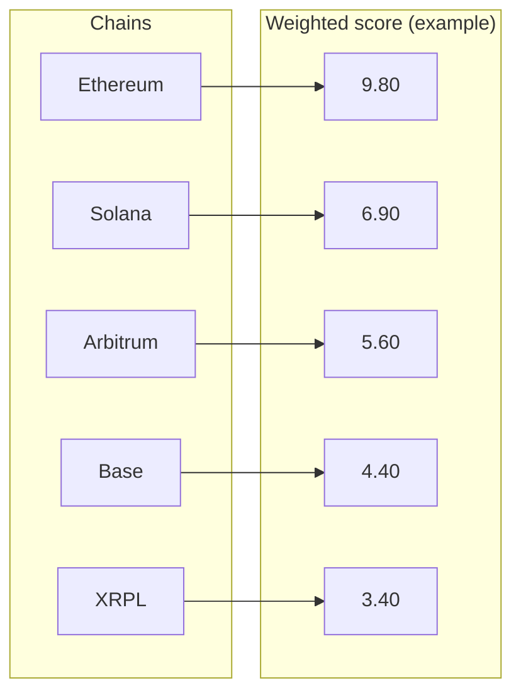
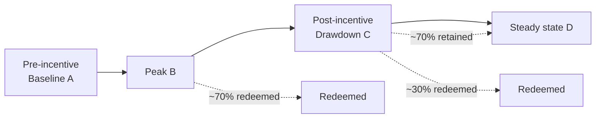

# Building an RWA Intelligence Suite: OpenEden Consulting Project

*Institutional-grade analysis for tokenized real-world assets — competitive landscape, on-chain velocity, and supply scenarios.*

---

## Why this project?

[OpenEden](https://openeden.com) is a protocol bringing real-world assets (RWA) on-chain: tokenized T-bills (TBILL), a yield-bearing stablecoin (USDO), and a multi-strategy yield product (PRISM). I was brought in to design and deliver an **analytical suite** that could answer three questions in a single, reproducible pipeline:

1. **How does PRISM compare** to tokenized yield peers, and how do we handle investor objections?
2. **How are TBILL and USDO used on-chain**, and where should the protocol expand next?
3. **What drove USDO supply collapse** after incentives, and what are plausible supply paths for the next 12 months?

The result is a three-module intelligence suite: cached data pipelines, analytics, report generation, and visualizations — all built so that every number can be traced back to a timestamped raw source.

---

## What we built

The suite is organized as a **single analysis workflow**: collect → validate → transform → report. Each module has its own data folder, so raw API responses are never mutated and every deliverable is reproducible.

**Deliverables at a glance:**

| Module | Core question | Primary outputs |
|--------|----------------|-----------------|
| **1** | How does PRISM compare to peers? | Competitive matrix, value proposition, investor objection handler |
| **2** | How are TBILL/USDO used on-chain? | Doppler case study (XRPL), Chain Priority Matrix, 90-day velocity recommendations |
| **3** | What drove USDO supply and what’s next? | Cohort flow (Sankey), Bear/Base/Bull scenarios, root-cause hypotheses |

---

## Architecture: data-first, reproducible

All financial logic uses `decimal.Decimal`; every data transformation has unit tests; API keys live in `.env` and raw responses are cached under `data/module1/`, `data/module2/`, and `data/module3/`. That way we can re-run the pipeline on a new date and diff the outputs instead of guessing.

---

## Module 1: Competitive landscape (PRISM vs. peers)

We compared PRISM to Ondo (OUSG), Maple (CMP), Hamilton Lane (SCOPE), Superstate (USTB), and others on net APY, risk profile, regulatory wrapper, redemption speed, DeFi composability, minimum investment, and AUM. A big takeaway: **yield (APY) is rendered client-side on protocol sites**, so static scraping couldn’t populate that column — a good example of where “best effort” data stops and manual or alternative feeds are needed.

We also produced a **differentiated value proposition** (multi-strategy, six chains, Bermuda/BVI wrapper) and an **investor objection handler** for five common allocator concerns, with confidence levels so stakeholders know what’s data-backed vs. assumed.

---

## Module 2: On-chain velocity and where to expand

Here we focused on **how** TBILL and USDO are used — especially on XRPL. XRPL holds a large share of tokenized T-bill issuance (~63%) but has very low TBILL transfer volume ($200/month vs. ~$3M/month on Ethereum). So we framed XRPL as a **storage layer**, not yet a trading/DeFi layer, and built a **Chain Priority Matrix** to recommend expansion order for USDO.

**Result:** Ethereum first, then Solana; XRPL last despite regulatory appeal, because of the velocity gap and weaker DeFi composability. We also delivered a **Doppler Finance case study** (addressable market, precedent, 6‑month estimate) and **three 90-day recommendations**: RLUSD/TBILL AMM pool on XRPL, TBILL as collateral for RLUSD borrowing, and TBILL in Ripple Payments corridors.

---

## Module 3: USDO supply scenarios and cohort flow

USDO supply peaked at **~$299M** (July 2025) and then fell to a **~$63–89M** band — a ~79% drawdown. Module 3 explains that path with a **cohort flow (Sankey)** and tests three hypotheses:

- **H1 (Structural):** Demand was incentive-dependent; weak organic retention → **Supported** (~70% of peak redeemed, ~30% retained).
- **H2 (Compositional):** Large holders churned, retail retained → **Not testable** without wallet-level data.
- **H3 (Competitive):** Users moved to USDY/USDM → **Partially supported** (circumstantial; those products had much smaller drawdowns).

We then defined **three 12-month scenarios** (Bear / Base / Bull) so strategy could plan for “supply stays low,” “recovery to $150–200M on one major composability win,” and "new peak >$300M" with clear assumptions and precedents (e.g. MakerDAO DSR, Olympus post-rebase).

*Conceptual cohort flow: supply moves from baseline → peak → drawdown → steady state; the majority of peak supply redeems, a smaller base remains.*

---

## How the modules connect

- **Module 1 and 3** both stress **track record and demand quality**: PRISM has no track record yet; USDO’s post-incentive collapse shows that supply built on incentives can reverse. So the narrative is: aim for **demonstrable, organic demand** and **sustainable incentive design**.
- **Module 2 and 3** align on **where and how** to grow: the Chain Priority Matrix (Ethereum → Solana → …; XRPL last) and the emphasis on composability and liquidity match Module 3’s base case (“at least one major composability or distribution win”) and the warning not to rely on incentive-only growth again.

---

## Tech stack and practices

- **Language:** Python 3.11+, type hints on all public functions.
- **Data:** `pandas` for tabular work, `httpx` for async HTTP; raw responses cached as JSON; processed outputs in the same module folder.
- **Finance:** `decimal.Decimal` for all monetary math — no floats for money.
- **Quality:** Unit tests for every transformation; financial sanity checks (yield &gt; 0, TVL &gt; 0, valid dates).
- **Reports:** Markdown reports generated from the same codebase; charts (e.g. Module 3 Sankey) produced with matplotlib from `cohort_flow.json`.

The repo layout is simple: `src/collectors/`, `src/analytics/`, `src/formatters/`, plus `data/`, `reports/`, and `charts/`. No black boxes — you can trace any figure back to a dated cache and a script.

---

## Takeaways

1. **Reproducibility pays off.** Caching raw API responses and never mutating them lets you re-run the pipeline, compare snapshots, and defend every number.
2. **Data gaps are part of the deliverable.** We called out missing APY, aggregated vs. product-level AUM, and untestable hypotheses (e.g. H2) so that strategy and investors see what’s evidence-based vs. assumed.
3. **Velocity and composability drive usage.** Chain choice isn’t just regulatory — XRPL’s low TBILL transfer volume and last place in the priority matrix show that integration depth and liquidity matter as much as institutional presence.
4. **Scenarios beat point forecasts.** Bear/Base/Bull with clear assumptions and precedents give the team a planning range and a shared language for “what we control” vs. “what we don’t.”

---

If you’re interested in RWA analytics, reproducible data pipelines, or institutional-grade reporting, I’d be happy to talk. You can find more of my work at [rahilbhavan.com](https://rahilbhavan.com) or reach out via the contact details there.

*Data and conclusions in the underlying project are as of the report dates (e.g. 2026-02-27); the blog post summarizes structure and findings rather than giving new figures.*
