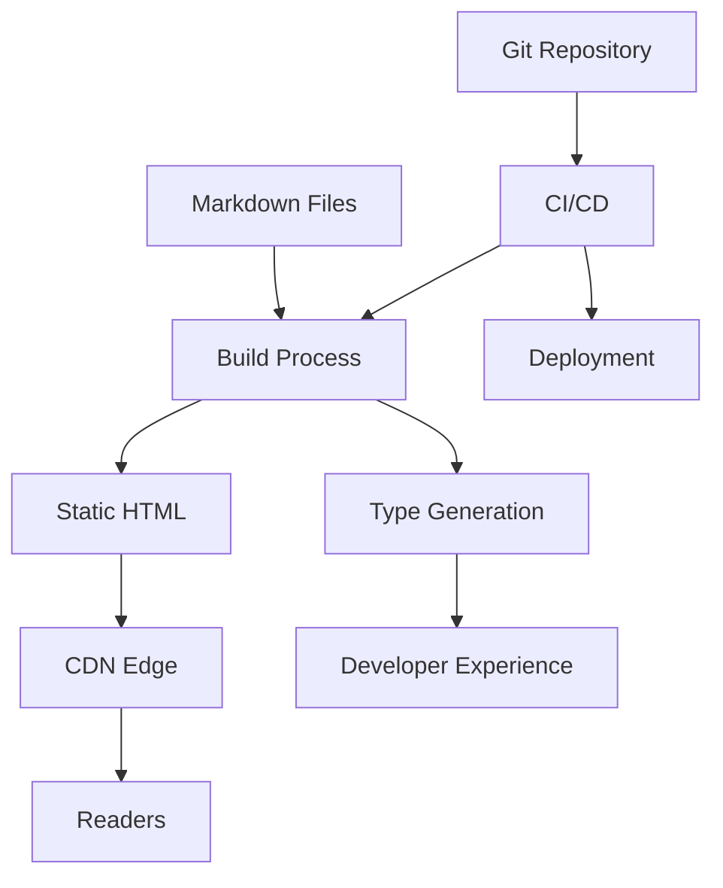

# Building a Modern Blog: Architecture and Technical Decisions

## Introduction

**Hook:** Choosing the right architecture for your blog isn't about picking the trendiest framework—it's about matching tools to principles. Every technical decision should answer: "Does this make writing and publishing easier?"

**Context:** In Part 1, we explored the philosophy behind building a modern blog. Now we'll dive into the technical architecture that brings those principles to life. We'll examine stack choices, design patterns, and the trade-offs that shape a performant, maintainable blog platform.

**Preview:** This post covers the technical architecture—from content management to deployment. You'll learn about static site generation, type-safe content collections, build pipelines, and how these choices enable the frictionless writing experience we discussed in Part 1.

## Background

Modern blog architecture has evolved significantly from traditional CMS platforms. The shift toward static site generation, JAMstack principles, and developer-centric workflows has created new possibilities for performance and simplicity.

### The Evolution of Blog Architecture

**Traditional (2000s-2010s):**
- Server-side rendering with PHP/WordPress
- Database-driven content
- Server required for every request
- Complex plugin ecosystems

**Modern (2020s):**
- Static site generation at build time
- File-based content (Markdown)
- Pre-rendered HTML served from CDN
- Minimal runtime dependencies

This evolution enables the principles we discussed in Part 1: simplicity, performance, ownership, and developer experience.

## Architecture Overview

### High-Level Architecture



### Core Components

1. **Content Layer**: Markdown files with frontmatter
2. **Build Layer**: Static site generator (Astro/Next.js)
3. **Type System**: TypeScript for type-safe content
4. **Deployment Layer**: Git-based CI/CD to edge CDN

## Content Architecture

### File-Based Content Management

Instead of a database, content lives as files:

```
src/content/
├── blog/
│   ├── post-1.md
│   ├── post-2.md
│   └── _template.md
└── config.ts
```

**Benefits:**
- Version control friendly (Git tracks changes)
- Portable (works anywhere)
- Simple (no database migrations)
- Type-safe (schema validation)

### Type-Safe Content Collections

Using Astro's content collections:

```typescript
// src/content/config.ts
import { defineCollection, z } from 'astro:content';

const blog = defineCollection({
  type: 'content',
  schema: z.object({
    title: z.string(),
    description: z.string().max(160),
    publishDate: z.date(),
    tags: z.array(z.string()).optional(),
    draft: z.boolean().default(false),
  }),
});

export const collections = { blog };
```

**Why this matters:**
- Autocomplete in your editor
- Compile-time validation
- Type safety across the codebase
- Clear documentation of content structure

## Build Architecture

### Static Site Generation (SSG)

**Build Process:**
1. Read Markdown files
2. Parse frontmatter
3. Render to HTML
4. Optimize assets
5. Generate static files

**Build Output:**
```
dist/
├── index.html
├── blog/
│   ├── post-1/
│   │   └── index.html
│   └── post-2/
│       └── index.html
└── assets/
    ├── styles.css
    └── images/
```

### Why Static Generation?

**Performance:**
- Zero server response time (pre-rendered HTML)
- Edge caching for global distribution
- Minimal JavaScript for faster loads

**Reliability:**
- No database to maintain
- No server to patch
- Fewer security vulnerabilities

**Scalability:**
- CDN handles traffic spikes
- No server costs for traffic
- Infinite horizontal scaling

## Technology Stack

### Static Site Generator: Astro

**Why Astro:**
- **Zero JS by default**: Ships no JavaScript unless needed
- **Content-focused**: Built for blogs and documentation
- **Framework agnostic**: Use React, Vue, or plain HTML
- **Fast builds**: Optimized for large content sites

**Alternative considerations:**
- **Next.js**: More features, but heavier for simple blogs
- **Hugo**: Extremely fast, but Go-based (less familiar to JS devs)
- **11ty**: Very flexible, but requires more configuration

### Type System: TypeScript

**Why TypeScript:**
- Type-safe content access
- Better IDE support
- Catch errors at compile time
- Self-documenting code

### Styling: Tailwind CSS

**Why Tailwind:**
- Utility-first approach
- Consistent design system
- Small bundle size (purges unused styles)
- Fast development iteration

### Deployment: Vercel/Netlify

**Why these platforms:**
- Git-based deployment
- Automatic builds on push
- Edge CDN included
- Free tier for personal projects

## Design Patterns

### Pattern 1: Content Collections

Organize content by type with schema validation:

```typescript
const blog = defineCollection({
  type: 'content',
  schema: z.object({
    title: z.string(),
    publishDate: z.date(),
    // ... more fields
  }),
});
```

**Benefits:**
- Type safety
- Validation at build time
- Clear content structure

### Pattern 2: Layout Components

Reusable layouts for consistent structure:

```astro
---
// BaseLayout.astro
interface Props {
  title: string;
  description?: string;
}
const { title, description } = Astro.props;
---

<html>
  <head>
    <title>{title}</title>
    <meta name="description" content={description} />
  </head>
  <body>
    <slot />
  </body>
</html>
```

**Benefits:**
- DRY (Don't Repeat Yourself)
- Consistent structure
- Easy to update globally

### Pattern 3: Build-Time Data Fetching

Fetch and process data at build time:

```typescript
// pages/blog/[slug].astro
export async function getStaticPaths() {
  const posts = await getCollection('blog');
  return posts.map(post => ({
    params: { slug: post.slug },
    props: { post },
  }));
}
```

**Benefits:**
- Data available at build time
- No runtime API calls
- Better performance

## Performance Optimizations

### Image Optimization

**Strategy:**
- Use `astro:assets` for automatic optimization
- Lazy loading for below-the-fold images
- WebP format with fallbacks
- Responsive image sizes

**Impact:**
- 60-80% reduction in image file sizes
- Faster page loads
- Better Core Web Vitals scores

### Code Splitting

**Strategy:**
- Route-based code splitting
- Lazy load non-critical components
- Minimal JavaScript in initial bundle

**Impact:**
- Smaller initial bundle
- Faster Time to Interactive (TTI)
- Better mobile performance

### Caching Strategy

**Strategy:**
- Static assets: Long-term caching
- HTML: Short-term caching with revalidation
- CDN edge caching for global performance

**Impact:**
- Instant loads for returning visitors
- Reduced server load
- Better global performance

## Common Pitfalls to Avoid

### Pitfall 1: Over-Engineering the Stack

**What goes wrong:** You choose a complex framework when a simple one would work.

**Why it happens:** We're drawn to powerful tools, even when we don't need them.

**How to avoid it:** Start simple. Add complexity only when you have a real problem to solve.

### Pitfall 2: Ignoring Build Performance

**What goes wrong:** Build times grow to minutes as content scales.

**Why it happens:** No optimization for large content collections.

**How to avoid it:**
- Use incremental builds
- Cache build artifacts
- Optimize image processing
- Profile build performance

### Pitfall 3: Breaking Type Safety

**What goes wrong:** Content schema changes break the site at runtime.

**Why it happens:** Schema validation disabled or ignored.

**How to avoid it:**
- Always use schema validation
- Type-check in CI/CD
- Version content schemas carefully

## Examples & Case Studies

### Example: Type-Safe Content Access

**Without type safety:**
```typescript
const post = posts.find(p => p.slug === slug);
const title = post?.frontmatter?.title; // Could be undefined
```

**With type safety:**
```typescript
const post = await getEntry('blog', slug);
const title = post.data.title; // TypeScript knows this exists
```

Type safety catches errors at compile time, not runtime.

### Example: Build Performance

**Before optimization:**
- 500 posts: 45 seconds build time
- Image processing: Sequential

**After optimization:**
- 500 posts: 12 seconds build time
- Image processing: Parallel with caching
- Incremental builds: 2 seconds for changes

## Conclusion

**Summary:** The architecture of a modern blog should serve the principles we established in Part 1. By choosing static site generation, type-safe content, and simple deployment, we create a platform that's fast, maintainable, and enjoyable to use.

**Key Takeaways:**

- **Static generation** enables performance and simplicity
- **Type safety** prevents errors and improves developer experience
- **File-based content** provides ownership and portability
- **Simple deployment** removes friction from publishing

**Call to Action:**

- Read [Part 1: Introduction](/blog/building-a-modern-blog-introduction-and-philosophy-part-1-3/) for the philosophy behind these choices
- Check out [Part 3: Case Study and Future](/blog/building-a-modern-blog-case-study-and-future-directions-part-3-3/) for real-world implementation
- Start building with these architectural patterns

## Related Posts

- [Building a Modern Blog: Introduction (Part 1)](/blog/building-a-modern-blog-introduction-and-philosophy-part-1-3/) - The philosophy behind modern blog architecture
- [Building a Modern Blog: Case Study and Future (Part 3)](/blog/building-a-modern-blog-case-study-and-future-directions-part-3-3/) - Real-world implementation and future directions
- [How My Automated Book System Works](/blog/how-my-automated-book-system-works/) - Example of automation in a modern blog

---

**Tags:** architecture, astro, typescript, static-sites, web-development
