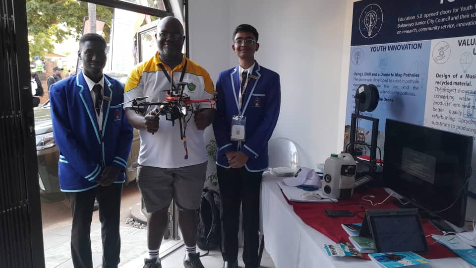
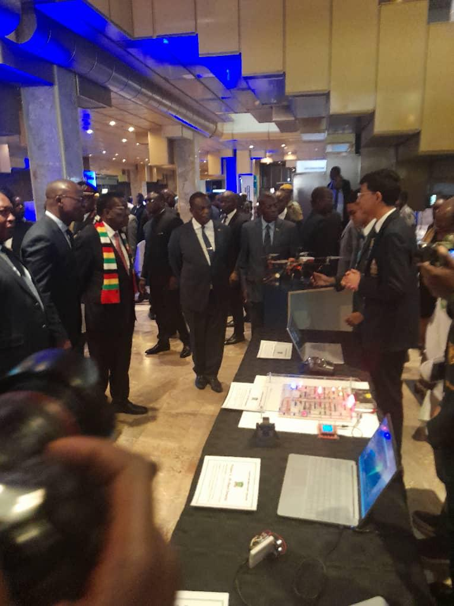
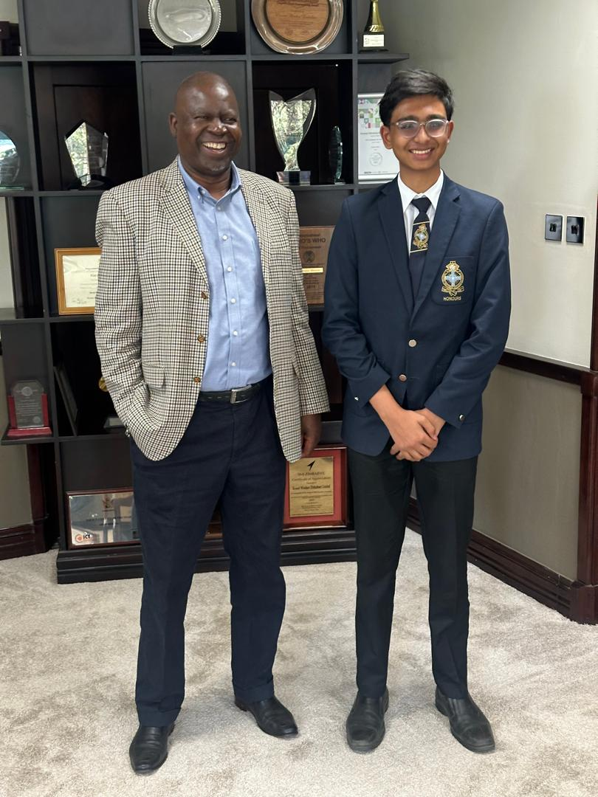

# From Prototype to President: Showcasing Innovation at ZITF (Part 3/3)

## Introduction

Engineering doesn't stop when the code compiles. The true test of any technology is whether it can survive the real world—and whether it delivers value to the people who need it. After building the custom CNC frame (Part 1) and programming the vision pipeline (Part 2), it was time to deploy. The **Bulawayo City Council** didn't just passively accept the data; they partnered with us to showcase the solution on a national stage. In this final chapter, I will discuss how we took this project from a garage in Bulawayo to the **Zimbabwe International Trade Fair (ZITF)**, where we secured **2nd Place** and had the honor of presenting the technology to both the leadership of **Econet** and the **President of Zimbabwe**.

## The Zimbabwe International Trade Fair (ZITF)

The ZITF is one of the largest intra-regional trade fairs in Africa, and it became the proving ground for our drone.

### Partnership with Bulawayo City Council

Collaborating with the City Council allowed us to position the drone not as a student science project, but as a municipal asset. We displayed the drone at their official stand, demonstrating to the public and government officials how autonomous systems could modernize infrastructure maintenance.

*The pothole detection drone on display at the ZITF Bulawayo City Council stand. This collaboration demonstrated how autonomous systems can be integrated into municipal workflows for efficient infrastructure monitoring.*

### The Award

The reception was overwhelming. Competing against established industry players and other innovators, our Pothole Detecting Drone was awarded **2nd Place** for innovation. This validation proved that low-cost, high-tech solutions have a viable place in the future of African infrastructure.

## Strategic Presentations

The visibility from ZITF opened doors to the highest levels of industry and government.

### Presenting to the President

One of the most pivotal moments of the project was the opportunity to present the drone to the **President of Zimbabwe**. This came when I was headhunted by the ministry of education for my recent news articles on the drone. In doing so, I was invited to The Zimbabwe Presidential Innovation Fair. I had the chance to explain the engineering behind the CNC chassis and the AI model, demonstrating how homegrown technology could solve national challenges like road safety and maintenance efficiency.

*A defining moment: presenting the autonomous pothole detection drone and its underlying AI architecture to the President of Zimbabwe. The discussion focused on how local innovation can solve critical national infrastructure challenges and improve road safety.*

### Engaging Industry Leaders (Econet)

Beyond the public sector, we engaged with the private sector, specifically presenting to the CEO of **Econet Wireless**, Dr. Douglas Mboweni.

* **The Discussion:** We explored how 5G connectivity could enhance the drone's capabilities, allowing for real-time cloud data streaming. Furthermore, I was invited to intern at the company over my A-Level break.
* **The Vision:** We framed the project as a foundational element of a "Smart City" initiative, showing that Zimbabwe has the technical talent to build its own future. Specifically, its applications for mine fields, agriculture, and data collection.

*Discussing the future of "Smart Cities" and 5G integration with Econet Wireless leadership. The presentation highlighted the drone's potential for real-time data collection across various sectors, including agriculture and mining.*

## Conclusion

**Summary:** This journey took me from a CAD design in a classroom to a handshake with the President. We proved that with a **Raspberry Pi**, some **aluminum**, and **Python code**, we could build tools that not only work but are recognized at the national level.

**Key Takeaways:**

* **Validation:** Winning 2nd Place at ZITF validated the "Master-Slave" architecture and the custom engineering approach.
* **Visibility:** Engineering is half the battle; communicating your solution to stakeholders—from city councils to Presidents—is what creates impact.

**Call to Action:**

* Check out the full **[Technical Breakdown Video](https://www.youtube.com/watch?v=LpTeKHJ6wRc)** on YouTube.
* News Articles: **[Herald Online](https://www.heraldonline.co.zw/comment-young-minds-must-create-solutions-that-will-drive-zimbabwe-forward/)** [Bulawayo24](https://bulawayo24.com/index-id-news-sc-national-byo-245074.html)
* Connect with me on **[LinkedIn](https://www.linkedin.com/in/rahil-bhavan)** to see photos from the ZITF presentation and the award ceremony.

---
