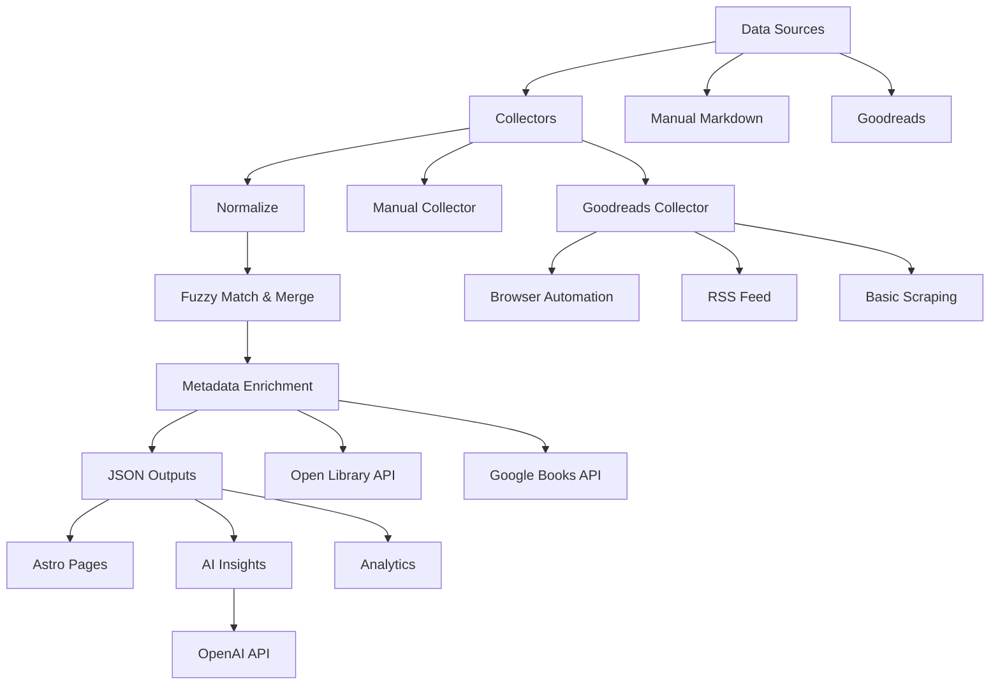

# How My Automated Book System Works

## Introduction

**Hook:** Have you ever tracked your reading across multiple platforms—Goodreads, Audible, physical books, notes—and wished you had a single unified view? I built an automated system that does exactly that, and it runs every time I deploy my blog.

**Context:** As someone who reads across different platforms and formats, I found myself manually maintaining reading lists in multiple places. This was tedious, error-prone, and made it impossible to get a complete picture of my reading habits. The solution? An automated pipeline that aggregates data from all sources, normalizes it, deduplicates entries, enriches missing metadata, and even generates AI-powered insights. This system is heavily inspired by [Ajay Misra's implementation](https://www.ajaymisra.com/posts/psuedocode) on [ajaymisra.com](https://www.ajaymisra.com).

**Preview:** In this post, I'll walk you through how my automated book system works at a high level—from collecting data from multiple sources to generating analytics and insights. You'll learn about the pipeline architecture, how it handles failures gracefully, and how it integrates into my blog's build process.

## Background

The core idea is simple: create a **single source of truth** for all my reading data by aggregating from multiple sources into unified JSON files that my Astro site can consume. The system needs to be:

- **Resilient**: If one source fails, others still work
- **Repeatable**: Every build produces the same output given the same inputs
- **Automatic**: Runs as part of the build process, no manual intervention
- **Intelligent**: Handles duplicates, enriches missing data, and generates insights

The system is inspired by [Ajay Misra's pseudocode post](https://www.ajaymisra.com/posts/psuedocode) on [ajaymisra.com](https://www.ajaymisra.com) and follows a similar architecture pattern—collectors gather raw data, an integration layer normalizes and deduplicates, and enrichment fills in gaps. Ajay's approach to multi-source data aggregation and fuzzy matching provided the conceptual foundation for this implementation.

## The Pipeline: From Sources to Insights

The system follows a six-stage pipeline that transforms raw data from multiple sources into a unified, enriched dataset with analytics and insights.

### System Architecture



### Stage 1: Collection

The system collects books from multiple sources:

- **Manual entries**: Markdown files in `src/content/books/` with frontmatter
- **Goodreads**: Three fallback methods in order of preference:
  1. **Browser automation** (Playwright): Most reliable, handles JavaScript-rendered content, supports authentication via cookies
  2. **RSS feeds**: No authentication needed if your profile has RSS enabled
  3. **Basic scraping** (Cheerio): Fallback if browser and RSS both fail

The collection stage is designed to be fault-tolerant. If Goodreads authentication fails, the system falls back to RSS or basic scraping. If all Goodreads methods fail, manual entries still get processed.

### Stage 2: Normalization

Raw data from different sources has inconsistent formatting:
- Author names: "Last, First" vs "First Last"
- Title variations: "The Book Title" vs "Book Title"
- Cover URLs: Different sizes and formats

The normalization layer standardizes:
- Author names to "First Last" format
- Titles by removing leading articles and special characters
- Cover URLs by removing size parameters (e.g., `_SX200_` from Goodreads URLs)

### Stage 3: Deduplication & Merging

When the same book appears in multiple sources (e.g., you manually added it and it's also on Goodreads), the system uses **fuzzy matching** to identify duplicates:

- **Similarity threshold**: 92% match required (based on word-based Jaccard similarity, following [Ajay Misra's implementation](https://www.ajaymisra.com/posts/psuedocode))
- **Matching criteria**: Both author and title must be similar
- **Merge strategy**: Combines data from all sources, preferring:
  - More complete data (ratings, dates, covers)
  - More recent dates
  - Higher ratings

This ensures you get the best data from each source without duplicates cluttering your library.

### Stage 4: Metadata Enrichment

After deduplication, the system enriches books with missing metadata from external APIs:

- **Open Library**: Fills in ISBNs, descriptions, and better cover images
- **Google Books**: Provides ratings, descriptions, and additional metadata

The enrichment process:
- Only enriches books missing key data (cover, description, ISBN)
- Uses rate limiting (200ms between requests) to be respectful to APIs
- Gracefully handles API failures—if enrichment fails, the book still gets saved

### Stage 5: Save & Serve

The enriched books are saved to `src/data/books.json`, which is consumed by the [Books page](/books) on my site. The page displays books with filtering, search, and sorting capabilities.

The system also generates:
- `src/data/insights.json`: AI-generated reading insights and recommendations
- `src/data/analytics.json`: Comprehensive reading statistics and trends

### Stage 6: AI Insights & Analytics

The final stage generates two types of outputs:

**AI Insights** (optional, requires `OPENAI_API_KEY`):
- Reading velocity trends (books per month/year)
- Genre preferences and evolution
- Author diversity scores
- Reading streak analysis
- Personalized book recommendations
- AI-generated summary of reading patterns

**Analytics**:
- Overview statistics (total books, average rating, etc.)
- Timeline breakdowns (by year, by month)
- Genre distribution and evolution
- Top authors with average ratings
- Rating distributions
- Reading goals and progress tracking

These outputs power the [Analytics page](/analytics) on my site, providing visualizations and insights into reading habits.

## Operational Best Practices

### Environment Variables

The system requires several environment variables:

- `GOODREADS_USER_ID`: Your Goodreads user ID or username (for Goodreads collection)
- `OPENAI_API_KEY`: Optional, for AI insights generation
- `ENABLE_METADATA_ENRICHMENT`: Optional, set to `false` to skip enrichment
- `GENERATE_INSIGHTS`: Optional, set to `false` to skip AI insights
- `INCREMENTAL_SYNC`: Optional, set to `true` for incremental updates

### Goodreads Authentication

For authenticated Goodreads access, the system uses browser automation with saved cookies:

1. **Export cookies**: Run `npm run export:goodreads-cookies` to open a browser and save cookies
2. **Cookie storage**: Cookies are saved to `scripts/.goodreads-cookies.json`
3. **Automatic use**: The browser collector automatically loads and uses these cookies

If cookies aren't available, the system falls back to RSS feeds or basic scraping.

### CI/CD Safety

The system includes safety checks for CI environments:

- **Preserves existing data**: If aggregation fails or returns no books, existing `books.json` is preserved
- **Graceful degradation**: Missing environment variables don't break the build
- **Error handling**: Failures in one source don't prevent others from working

This ensures your site always has book data, even if external sources are temporarily unavailable.

### Incremental Updates

The system supports incremental sync mode:

- Tracks last sync timestamp per source
- Only processes books added/modified since last sync
- Reduces processing time and API calls

Enable with `INCREMENTAL_SYNC=true` environment variable.

## Examples & Case Studies

### Example: A Typical Run

Here's what happens during a typical aggregation run:

1. **Collection**: 
   - 5 books from manual markdown files
   - 47 books from Goodreads (browser automation with cookies)
   - Total: 52 raw books

2. **Normalization**: 
   - Author names standardized ("Smith, John" → "John Smith")
   - Titles cleaned ("The Great Gatsby" → "Great Gatsby" for matching)
   - Cover URLs normalized

3. **Deduplication**: 
   - 3 duplicates found (same book in manual + Goodreads)
   - Merged into 3 unified entries with combined metadata
   - Final count: 49 unique books

4. **Enrichment**: 
   - 12 books missing covers → enriched from Open Library
   - 8 books missing descriptions → enriched from Google Books
   - Rate-limited to 200ms between requests

5. **Output**: 
   - `books.json`: 49 enriched books
   - `insights.json`: AI-generated insights and 5 recommendations
   - `analytics.json`: Complete statistics and trends

6. **Site Update**: 
   - Books page shows 49 books with filters and search
   - Analytics page shows reading trends and insights

### Example: Handling Goodreads Auth Failure

What happens when Goodreads authentication fails:

1. Browser automation tries to load cookies → not found
2. Falls back to RSS feed → attempts to fetch
3. RSS feed returns 404 (not enabled or private)
4. Falls back to basic scraping → attempts HTML parsing
5. Basic scraping fails (page requires login)
6. **Result**: Manual books still processed (5 books), Goodreads skipped gracefully
7. Site still builds successfully with available data

This demonstrates the system's resilience—partial failures don't break the entire pipeline.

## Common Pitfalls to Avoid

### Pitfall 1: Missing Environment Variables

**What goes wrong:** The system runs but collects no books, or certain features don't work.

**Why it happens:** Environment variables aren't set in your deployment platform (Vercel, Netlify, etc.) or local `.env` file.

**How to avoid it:** 
- Set `GOODREADS_USER_ID` in your deployment platform's environment variables
- For local development, create a `.env.local` file with required variables
- Check the build logs to see which sources are being skipped

### Pitfall 2: Goodreads Authentication Issues

**What goes wrong:** Goodreads collection returns empty results even though you have books.

**Why it happens:** Cookies expired, RSS feeds disabled, or Goodreads changed their HTML structure.

**How to avoid it:**
- Re-export cookies periodically: `npm run export:goodreads-cookies`
- Enable RSS feeds in your Goodreads privacy settings
- Check browser collector logs for authentication errors
- The system will fall back to other methods automatically

### Pitfall 3: API Rate Limiting

**What goes wrong:** Metadata enrichment fails or gets rate-limited.

**Why it happens:** Too many requests to Open Library or Google Books APIs.

**How to avoid it:**
- The system already includes 200ms rate limiting between requests
- Only enriches books missing key data (not all books)
- If you have many books, consider disabling enrichment: `ENABLE_METADATA_ENRICHMENT=false`

### Pitfall 4: Upstream Changes Break Scraping

**What goes wrong:** Goodreads changes their HTML structure, breaking the scraper.

**Why it happens:** Websites update their markup, breaking CSS selectors.

**How to avoid it:**
- The system uses multiple fallback selectors for robustness
- Browser automation is more resilient than basic scraping
- Consider using RSS feeds (more stable) or the official Goodreads API if available
- Monitor build logs for scraping warnings

### Pitfall 5: Sparse Data in Manual Entries

**What goes wrong:** Books from manual markdown files lack ratings, dates, or covers.

**Why it happens:** Manual entries might not include all metadata fields.

**How to avoid it:**
- The enrichment stage will fill in missing data automatically
- Include as much metadata as possible in manual entries (ratings, dates, covers)
- The system merges data from all sources, so Goodreads data can supplement manual entries

> **💡 Tip:** The system is designed to work with partial data. Even if some sources fail or data is incomplete, you'll still get a functional books page with whatever data is available.

> **⚠️ Warning:** Don't commit cookies or API keys to version control. Use environment variables and `.gitignore` to keep sensitive data secure.

> **📝 Note:** The system runs automatically on every build (`npm run build`), so your books page stays up-to-date without manual intervention.

## How to Run It

### Manual Aggregation

Run the aggregation script directly:

```bash
npm run aggregate:books
```

This will:
1. Collect books from all sources
2. Normalize and deduplicate
3. Enrich metadata
4. Generate insights and analytics
5. Save to `src/data/*.json`

### Automatic on Build

The system runs automatically before each build:

```bash
npm run build
```

This executes `aggregate:books` then builds the Astro site.

### Incremental Sync

For faster updates, use incremental sync:

```bash
INCREMENTAL_SYNC=true npm run aggregate:books
```

This only processes books added/modified since the last sync.

### Export Goodreads Cookies

To set up Goodreads authentication:

```bash
npm run export:goodreads-cookies
```

This opens a browser window—log in to Goodreads, and cookies will be saved automatically.

## Conclusion

**Summary:** My automated book system aggregates reading data from multiple sources, normalizes and deduplicates it, enriches missing metadata, and generates AI-powered insights—all automatically as part of my blog's build process. The system is designed to be resilient, handling failures gracefully and always producing usable output.

**Key Takeaways:**

- **Multi-source aggregation** creates a unified view of reading data across platforms
- **Fuzzy matching and merging** eliminates duplicates while preserving the best data from each source
- **Graceful degradation** ensures the system works even when some sources fail
- **Automated insights** provide valuable analytics without manual analysis
- **Build integration** keeps your books page up-to-date automatically

**Call to Action:** 

- Check out the [Books page](/books) to see the system in action
- Explore the [Analytics page](/analytics) for reading insights
- Read [Ajay Misra's original pseudocode post](https://www.ajaymisra.com/posts/psuedocode) on [ajaymisra.com](https://www.ajaymisra.com) that inspired this implementation
- Try building your own aggregation pipeline for your data sources

## Related Posts

- [Ajay Misra's Pseudocode Post](https://www.ajaymisra.com/posts/psuedocode) on [ajaymisra.com](https://www.ajaymisra.com) - The original inspiration and conceptual foundation for this system
- [Why I Built a Drone for Zimbabwe's Roads (Part 1)](/blog/why-i-built-a-drone-for-zimbabwes-roads-part-1/) - Another automation project with similar principles

---

**Tags:** automation, data-pipeline, books, typescript, astro
